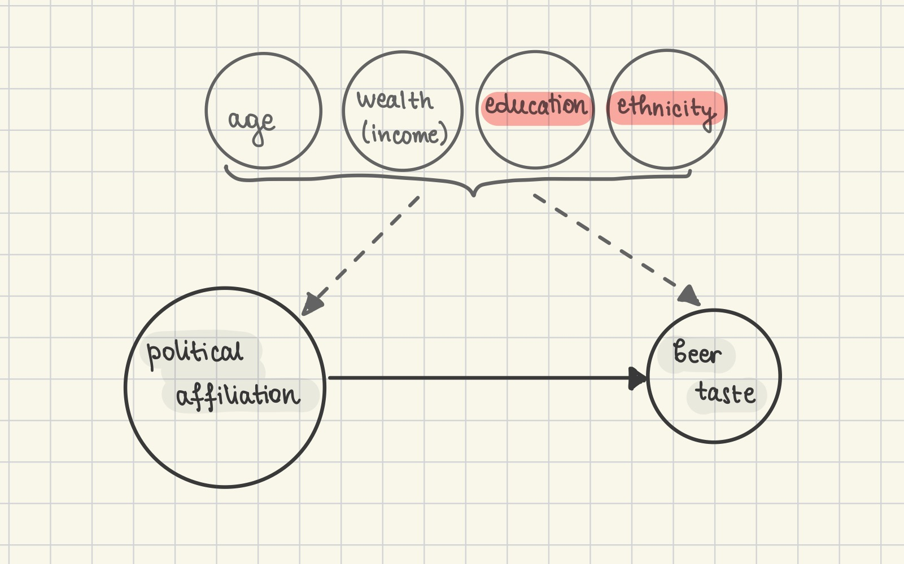

# Pints & Politics: Analyzing Beer Preferences Across U.S. States


## Abstract
This study dives into the fascinating link between beer preferences and political identities in the U.S. By analyzing beer styles, emotions, sentiments, and key attributes through user reviews, we uncover patterns that go beyond taste. Using tools like LDA and sentiment analysis, we’ll map out how different states' beer choices align with political leanings. We'll also explore whether beer preferences shift during election years, especially in swing states. Can beer really reveal more than just flavour? We aim to find out!


## Research Questions


Q1. How can beer preferences be categorized and visualized across different dimensions (such as style, emotion, sentiment, and key attributes) to provide a comprehensive understanding of beer types based on the US reviewers?

Q2. How do these beer preferences (referred to Q1) vary across different U.S. states, and can these preferences be linked to political ideologies? Are there specific beer preferences that correlate with Republican or Democratic voting patterns?

Q3. How do beer preferences change over time during election years, particularly in swing states? Is there such a thing as an *election beer* in terms of style and emotion it brings?


## Proposed datasets


### 1. U.S. President Dataset ([link](https://doi.org/10.7910/DVN/42MVDX))

This dataset contains presidential election results by state from 1976 to 2020.

It is complete with no missing values and includes all 50 states for each year. For our analysis, we focus on election years 2004, 2008, 2012, and 2016 (subset: 2001–2017) to align with our beer reviews. 

This lightweight dataset (501KB, 4288 lines) is easy to manipulate. So far we calculated vote proportions by party per state (party_winners_over_years.csv) and identified "swing" states (those changing party allegiance, party_winners.csv).


### 2. The Correlates of State Policy Dataset ([link](https://ippsr.msu.edu/public-policy/correlates-state-policy))

The CSPP dataset includes over 3,000 variables covering policy outputs and political, social, and economic factors across the 50 U.S. states from 1900 to 2019. For our analysis, we focus on variables such as the population by age group (e.g., 18-24, 25-44), minimum legal drinking age, and personal income per capita.

The dataset is provided as a CSV file (~70 MB) and includes a PDF with detailed variable definitions and availability across years. While many variables contain "NA" values, likely due to data going back over a century, we confirmed that the variables we need have sufficient coverage for our timeframe (2001-2017).


## Methods


We have separated the project into 3 tasks, each of them corresponding to one of the research questions above.


### Task 1. Characterizing beer preferences


To define diverse beer preferences, we will examine different dimensions such as beer style, emotions they bring, and sentiment. For beer styles, we will manually select five key categories and use LDA to identify descriptive keywords for each style. To analyze emotions, we will leverage text embeddings using a small language model to classify reviews based on proximity to predefined emotional descriptors (e.g., refreshing, surprising). For sentiment analysis, we will employ a classifier to label reviews as either positive or negative, allowing us to gauge overall sentiment toward different beer types.


### Task 2. Beer preferences and political affiliation
Our goal is to analyze beer style preferences across states and their potential connection to political affiliations. We'll focus on popular beer styles and account for confounding factors like age, wealth, and geographical location, which may influence both beer preferences and political leanings.

Given the limitations of our dataset, we won’t be able to estimate factors like education and ethnicity based on text alone. For instance, it's tricky to infer education levels or ethnicity from English-written reviews with “random” usernames. Therefore, we will focus on age, wealth, and location as confounding factors, using state-level estimates.

To estimate age, we'll assume users registered at the legal drinking age in their state and calculate it as the legal age plus years since registration. This will basically give us a lower bound of the age. If we find a high proportion of reviewers near the legal drinking age (meaning they created an account for one review only), we’ll refine our estimates using demographic data from the CSPP dataset, which includes state population percentages by age range (e.g., 25-44 years old).

For wealth, we'll use the state's mean income per capita, available in Dataset #2.

For each beer preference category (defined in Task 1), we will then perform causal analysis by matching Democratic and Republican states to minimize propensity score on identified factors to determine whether there is any political association with beer preferences.





### Task 3. Time Series Analysis of Beer Preferences Over Election Years
We will investigate how beer preferences change over time during election years, particularly in swing states, and whether certain beers emerge as an election beer. By analyzing beer reviews from election years and tracking party affiliation changes by state, we’ll explore the popularity of beer styles and the emotions associated with them, using review counts, average ratings, and sentiment analysis. We will also examine the characteristics of an election beer, focusing on its style and the emotions it brings. A time series analysis will determine if these preferences align with election cycles, especially in swing states, and regression methods will help assess any correlation with political shifts, controlling for demographic factors like age and wealth.

## Proposed timeline

- 15.11. Search for Datasets, Data Handling and Preprocessing and Exploratory Data Analysis
- 29.11. Implementation of tasks divided between team members
- 06.12. Initial result analysis, refining methods and combining data stories
- 13.12. Final analysis and website assembly
- 20.12. Final project deadline


## Organization within the team

- Sara: Task 2
- Marija: Task 2
- Luc: Task 3
- David: Task 1
- Mikael: Task 3

Each team member will be responsible for creating the final visualization for their respective task, completing the data story.

## Questions for TAs (optional)

Does the pipeline for the causal analysis make sense? Especially in terms of matching across the states.

___
## Quickstart

```bash
# clone project
git clone <project link>
cd <project repo>

# [OPTIONAL] create conda environment
conda create -n <env_name> python=3.11 or ...
conda activate <env_name>


# install requirements
pip install -r pip_requirements.txt
```


### How to use the library
Tell us how the code is arranged, any explanations goes here.


## Project Structure

The directory structure of the project looks like this:

```
├── data                        <- Project data files (original data)
│   ├── generated                        <- Generated csv/pickle files
│
├── src                         <- Source code
│   ├── data                            <- Data directory (data processing, results stored in data/generated)
│   ├── ipynb scripts                   <- Jupyter Notebooks for analyzing additional datasets
│   ├── models                          <- Model directory
│   ├── utils                           <- Utility directory
│
├── tests                       <- Tests of any kind
│
├── results.ipynb               <- a well-structured notebook showing the results
│
├── .gitignore                  <- List of files ignored by git
├── pip_requirements.txt        <- File for installing python dependencies
└── README.md
```

